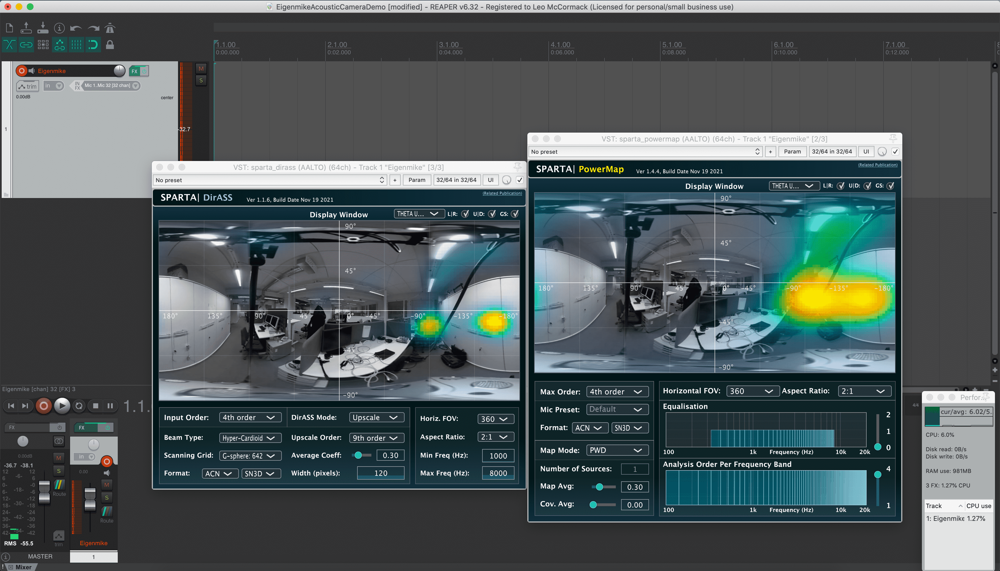

# AcousticCamera

Plug-ins used: [sparta_array2sh](https://leomccormack.github.io/sparta-site/docs/plugins/sparta-suite/#array2sh), [sparta_powermap](https://leomccormack.github.io/sparta-site/docs/plugins/sparta-suite/#powermap),
[sparta_dirass](https://leomccormack.github.io/sparta-site/docs/plugins/sparta-suite/#dirass).

This example project is configured to stream the 32-channels from an Eigenmike32 spherical microphone array, encode this input into fourth-order Ambisonics, and then visualise the sound scene. Optionally, if a 360-degree camera is mounted above the microphone array, then the corresponding image may be placed behind the visualisation maps; thus, creating a make-shift "acoustic camera":

 

The microphone array to ambsonics signals conversion is performed by **sparta_array2sh**. Note that this example also works if you swap out the Eigenmike for e.g. a Zylia ZM-1, or a first-order A-format microphone, in which case the appropriate preset/settings should be selected in sparta_array2sh, and the below visualisation will cap-out at third- and first-order, respectively.

The Ambisonic signals are then sent to the **sparta_powermap** plug-in, which visualises the sound-field based on steering hyper-cardioid beamformers in many directions on the sphere (also referred to as a plane-wave decomposition [PWD]), and plotting their relative energies with a colour gradient. This is also referred to as steered-response power (SRP) based visualisation.

 

Note that this energy-based approach also provides a good visual depiction of how sampling ambisonic decoding (SAD) would "look" like, if the same sound scene was decoded and played over a spherical loudspeaker array. It can then be shown that the higher the visualisation/decoding order, the less the energy of sound sources is "smeared" to adjacent visualisation grid-points/loudspeakers. 

The **sparta_powermap** plugin also implements higher-resolution visualisation alternatives, such as the MUltiple-Signal Classification (MUSIC) algorithm. Although, they deviate from the "visual counterpart to ambisonics decoding" analogy, such methods do provide sharper images than the beamformer based approaches.
Another high-resolution alternative is **sparta_dirass**, which aims to spatially upmix the Ambisonic input to a higher-order; e.g. fourth-order to ninth-order, which, in this case makes it easier to see that there is a reflection coming off the right wall of cupboards:

 

The **sparta_dirass** plug-in may, therefore, be considered as the visual counterpart for the Ambisonic upmixers: **compass_upmixer**, and **hodirac_upmixer**.

