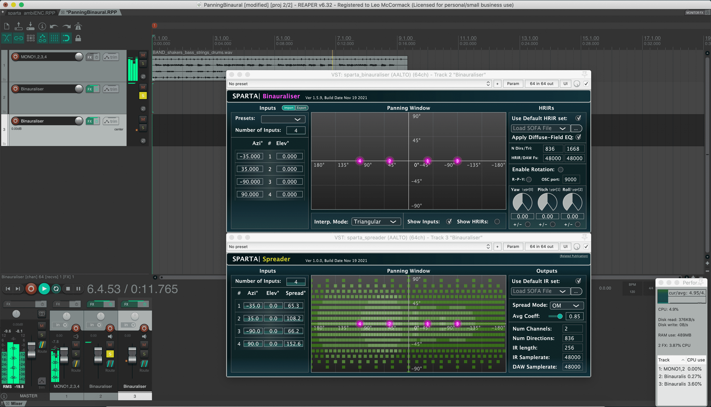

# PanningBinaural

Plug-ins used: [sparta_binauraliser](https://leomccormack.github.io/sparta-site/docs/plugins/sparta-suite/#binauraliser), [sparta_spreader](https://leomccormack.github.io/sparta-site/docs/plugins/sparta-suite/#spreader).

This example project uses the **sparta_binauraliser** plugin is spatialise mono signals in specific directions over headphones. The project also demonstrates the **sparta_spreader** plugin, which is able to produce spatially extended sound sources that are "diffuse" across their full extents. 

 

Note, although not explored in this example, the **sparta_spreader** is general and can therefore also be configured to create synthetic microphone array recordings of spread sound sources. In which case, simply use the SOFA loader to instead load microphone array impulse response (IR) measurements (e.g. 4-channel A-format IRs), rather than the default 2-channel head-related impulse responses (HRIRs), and the processing is exactly the same. 
