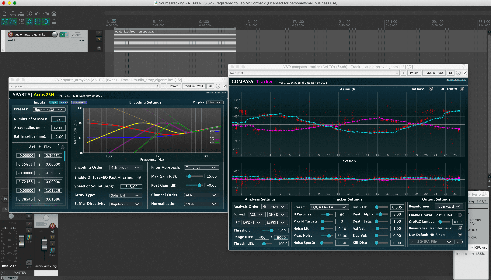

# SourceTracking

Plug-ins used: [sparta_array2sh](https://leomccormack.github.io/sparta-site/docs/plugins/sparta-suite/#array2sh), [compass_tracker](https://leomccormack.github.io/sparta-site/docs/plugins/compass-suite/#tracker).

 

In this project, Eigenmike signals are encoded into fourth-order Ambisonics using **sparta_array2sh**, and then passed to **compass_tracker**, which tracks the source directions over time and steers a hyper-cardioid virtual microphone towards them, followed by binauralising their signals in the same tracked directions.
