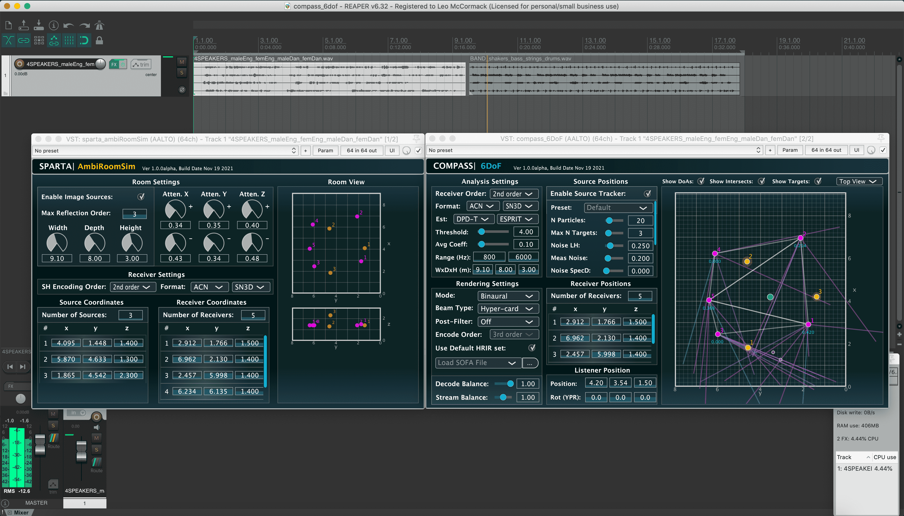

# compass_6dof_example

 

In this project, mono signals are encoded using the [sparta_ambiRoomSim](https://leomccormack.github.io/sparta-site/docs/plugins/sparta-suite/#ambiroomsim) plug-in for multiple receiver positions. These simulated Ambisonic signals/receivers are then passed to the [compass_6dof](https://leomccormack.github.io/sparta-site/docs/plugins/compass-suite/#6dof) plug-in, which tracks the encoded sound source positions and spatialises the sound scene binaurally w.r.t the listener position.
